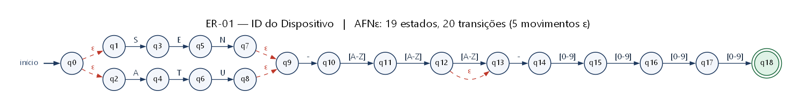

# Auditor Léxico de Telemetria de Sensores Industriais

Ferramenta de linha de comando que funciona como um **firewall léxico** para redes industriais: cada
pacote de texto enviado por sensores e atuadores só é aceito se pertencer à linguagem de uma das
**cinco Expressões Regulares** do protocolo. Pacotes corrompidos são bloqueados e recebem um
diagnóstico com a causa provável e a **coluna exata do erro**, obtida pela simulação do AFNε da ER.

Trabalho do 1º bimestre de **Linguagens Formais e Autômatos** — Ciência da Computação, CESUPA.

| Documento | Arquivo |
| :-- | :-- |
| Relatório técnico | [`docs/Relatorio_Tecnico.pdf`](docs/Relatorio_Tecnico.pdf) · [versão Markdown](docs/Relatorio_Tecnico.md) |
| Apresentação | [`docs/Apresentacao.pptx`](docs/Apresentacao.pptx) · [`docs/Apresentacao.pdf`](docs/Apresentacao.pdf) |
| Roteiro da apresentação | [`docs/Roteiro_Apresentacao.md`](docs/Roteiro_Apresentacao.md) |
| AFNε (JFLAP 7.1) | [`automatos/jflap/`](automatos/jflap/) · resultado no JFLAP: [`resultado_jflap.md`](automatos/jflap/resultado_jflap.md) |
| Diagramas dos AFNε | [`automatos/diagramas/`](automatos/diagramas/) (SVG, PNG e DOT) |

## As cinco Expressões Regulares

Todas são aplicadas com `re.fullmatch` (a cadeia inteira precisa pertencer à linguagem) e não usam
atalhos dependentes do motor (`\d`, `\w`, `\s`, `.` curinga), âncoras, retroreferências ou lookarounds.

| ER | Valida | Padrão no código (`src/expressoes.py`) | Exemplo aceito |
| :-- | :-- | :-- | :-- |
| ER-01 | ID do dispositivo | `(SEN\|ATU)-[A-Z]{2,3}-[0-9]{4}` | `ATU-VLV-0420` |
| ER-02 | Telemetria | `SEN-[A-Z]{2,3}-[0-9]{4}:(TEMP=…C\|UMID=…%\|PRES=…hPa)` | `SEN-TM-0001:TEMP=-10.5C` |
| ER-03 | Comando de controle | `CMD ATU-[A-Z]{2,3}-[0-9]{4} (LIGAR\|DESLIGAR\|ABRIR\|FECHAR\|AJUSTAR (100\|[1-9]?[0-9])%)` | `CMD ATU-YY-9999 AJUSTAR 75%` |
| ER-04 | IPv4 / CIDR | `((25[0-5]\|2[0-4][0-9]\|1[0-9][0-9]\|[1-9]?[0-9])\.){3}(…)(/(3[0-2]\|[12]?[0-9]))?` | `172.16.254.1/32` |
| ER-05 | Alerta de log | data (dia válido para o mês) `T` hora, severidade, ID e mensagem | `2026-09-30T08:15:00 WARN SEN-AB-1234: bateria fraca` |

Os padrões completos, a ER formal (com definições regulares), o alfabeto, a linguagem, a tabela de
equivalência, o AFNε e os 16 testes de cada ER estão nas **fichas do
[relatório técnico](docs/Relatorio_Tecnico.md#3-fichas-das-expressões-regulares)**.
Exemplo: a ER-01 na notação formal e seu AFNε (construção de Thompson, ε tracejado em vermelho):

```text
⟨ID⟩ = (SEN | ATU) - [A-Z][A-Z]([A-Z] | ε) - [0-9][0-9][0-9][0-9]
```



## Instalação

Requisitos: **Python 3.11 ou superior**. A aplicação usa apenas a biblioteca padrão; o `pytest` é
necessário só para os testes.

```bash
git clone https://github.com/cauebarroso/Auditor-de-sensores-industriais-com-express-es-regulares.git
cd Auditor-de-sensores-industriais-com-express-es-regulares
pip install -r requirements.txt
```

## Execução

```bash
python src/auditor.py                                   # menu interativo
python src/auditor.py dados/dados_exemplo.txt           # auditoria em lote + filtros
python src/auditor.py dados/turno_caldeira.txt --exportar relatorio.json   # também .csv ou .txt
python src/auditor.py --pacote "SEN-TM-0001:TEMP=25.5C" "CMD ATU-VLV-0420 AJUSTAR 101%"
python src/auditor.py --explicar "ATU-VLV-0420"         # simulação do AFNε passo a passo
python src/auditor.py --expressoes                      # as cinco ERs (formal e código)
```

Menu interativo:

```text
  [1] Auditar arquivo de pacotes (.txt) em lote
  [2] Validar pacotes digitados (modo interativo)
  [3] Simular o AFNε passo a passo para um pacote
  [4] Ver as cinco expressões regulares
  [0] Sair
```

Exemplo de pacote rejeitado — o apontador vem da simulação do AFNε:

```text
  [ERRO] ER-03 Comando de Controle: valor de ajuste 101% acima de 100%; o intervalo aceito é 0 a 100%.
         CMD ATU-VLV-0420 AJUSTAR 101%
                                    ^
         Onde: coluna 28: símbolo '1' inesperado; esperado um símbolo de [0%]
```

**Entradas vazias ou inválidas** (pacote vazio, só espaços, arquivo inexistente, pasta, arquivo vazio,
arquivo binário, opção de menu inválida) são tratadas com mensagens claras, sem encerrar o programa.

## Testes

```bash
python -m pytest
```

São **314 testes** em `tests/`:

| Arquivo | O que verifica |
| :-- | :-- |
| `casos_teste.py` | Fonte única dos casos: **8 cadeias aceitas e 8 rejeitadas por ER**, com casos-limite marcados |
| `test_expressoes.py` | Cada cadeia em `re.fullmatch`; mínimo de 6 + 6 e caso-limite; categoria única; atalhos proibidos |
| `test_automatos.py` | AFNε × `re` (casos + 10.000 cadeias aleatórias); **prova** de que ER formal ≡ código e `.jff` ≡ código; linguagens disjuntas; linguagem finita/infinita |
| `test_aplicacao.py` | Entradas vazias/inválidas, diagnósticos, coluna do erro, lote, extração, exportação, CLI e modo interativo |

## AFNε e JFLAP

Os AFNε são **gerados a partir do próprio padrão do código** pela construção de Thompson
(`src/construtor_afn.py`). Em `automatos/jflap/` há um `.jff` por ER, com **uma transição por símbolo**
(o JFLAP lê um símbolo por transição), então o autômato reconhece exatamente a linguagem da ER.

Para testar no JFLAP 7.1: abra `automatos/jflap/ER-0X.jff` → **Input › Multiple Run** →
**Load Inputs** → escolha `automatos/jflap/entradas/ER-0X.txt` → **Run Inputs**.

A verificação também pode ser feita sem interface gráfica, com o motor do próprio JFLAP
(requer JDK e o `JFLAP7.1.jar` em `scripts/jflap/`):

```bash
python scripts/verificar_jflap.py        # resultado atual: 80/80 cadeias conferem
```

> O JFLAP 7.1 interpreta rótulos que contêm `[` como intervalo (`[a-z]`) e falha com o símbolo `[`.
> Por isso a severidade do log é escrita sem colchetes (`INFO`, não `[INFO]`).

## Estrutura do repositório

```text
├── src/
│   ├── auditor.py           # interface: menu, modos interativo e lote, argumentos
│   ├── expressoes.py        # as 5 ERs e as fichas (alfabeto, linguagem, ER formal)
│   ├── diagnostico.py       # causa provável e coluna do erro (simulação do AFNε)
│   ├── relatorio.py         # leitura de arquivos, extração, estatísticas, exportação
│   ├── afn.py               # AFNε: fecho-ε, simulação, equivalência, interseção
│   ├── construtor_afn.py    # analisador do subconjunto regular + construção de Thompson
│   ├── jflap.py             # leitura/escrita de .jff
│   └── diagramas.py         # diagramas DOT (inteiros ou divididos em partes)
├── tests/                   # casos de teste e suítes pytest
├── dados/                   # dados de exemplo (inclui um arquivo vazio para teste)
├── automatos/
│   ├── jflap/               # .jff, entradas para Multiple Run e resultado no JFLAP
│   └── diagramas/           # SVG/PNG/DOT dos AFNε (e partes/, para páginas e slides)
├── scripts/                 # geradores de AFNε, relatório e slides; verificação no JFLAP
├── docs/                    # relatório técnico, apresentação e roteiro
├── requirements.txt
└── pytest.ini
```

### Regenerar os artefatos

Depois de alterar uma ER em `src/expressoes.py` (e a ER formal correspondente na mesma ficha):

```bash
python -m pytest                        # confere ER formal ≡ código e todos os casos
python scripts/gerar_automatos.py       # .jff, diagramas e entradas do JFLAP (Graphviz opcional)
python scripts/verificar_jflap.py       # executa os .jff no motor do JFLAP
python scripts/gerar_relatorio.py       # docs/Relatorio_Tecnico.md e .pdf
python scripts/gerar_apresentacao.py    # docs/Apresentacao.pptx e .pdf
```

Os geradores de documentos usam `pip install markdown python-pptx pillow`, o Graphviz (`dot`) para as
imagens e o Microsoft Edge ou o Google Chrome para imprimir os PDFs.

## Contribuições dos integrantes

| Integrante | Contribuições |
| :-- | :-- |
| Augusto Rodrigues | ER-01 e ER-02 (fichas, AFNε e testes); módulo de diagnóstico de falhas |
| Caue Jadão | ER-03 e ER-04 (fichas, AFNε e testes); revisão geral, verificação de equivalência, relatório e repositório |
| César Augusto | ER-05 (ficha, AFNε e testes); modo lote, relatório de conformidade, exportação e apresentação |

## Uso de Inteligência Artificial

Conforme a Resolução de Uso de IA do curso de Ciência da Computação (CESUPA, 2026), declaramos o uso
de IA generativa como ferramenta de **apoio**:

- **Antigravity (Google DeepMind)**: versão inicial do `auditor.py` e dos testes, primeiros arquivos
  `.jff` e formatação do relatório e do README.
- **Claude (Anthropic), via Claude Code**: revisão das ERs e da notação formal, reestruturação em
  módulos, construção de Thompson e verificação de equivalência, geração dos `.jff` e diagramas,
  ampliação dos testes, relatório técnico e slides.

As decisões de projeto são da equipe. Todo o conteúdo produzido com apoio de IA foi revisado, e todos
os integrantes compreendem, explicam e conseguem modificar o código, as ERs e os autômatos.

## Referências

Hopcroft, Motwani e Ullman, *Introdução à Teoria de Autômatos, Linguagens e Computação*; P. B. Menezes,
*Linguagens Formais e Autômatos*; K. Thompson, *Regular expression search algorithm* (CACM, 1968);
documentação do módulo [`re`](https://docs.python.org/3/library/re.html); [JFLAP](https://www.jflap.org).
Lista completa no relatório técnico.
