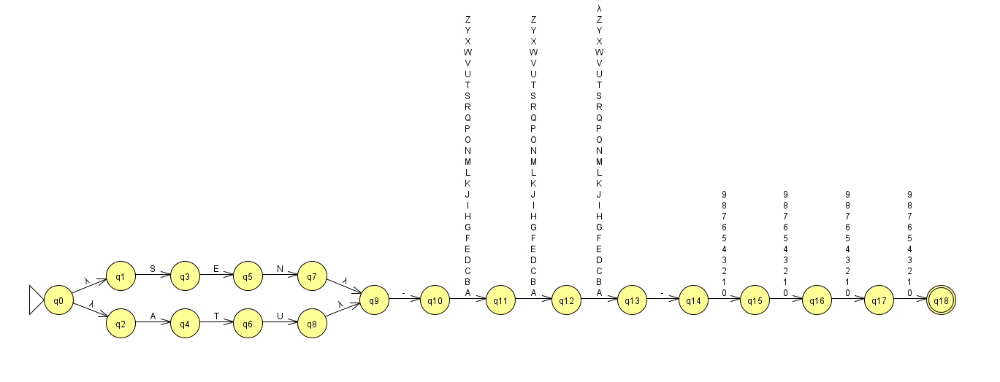
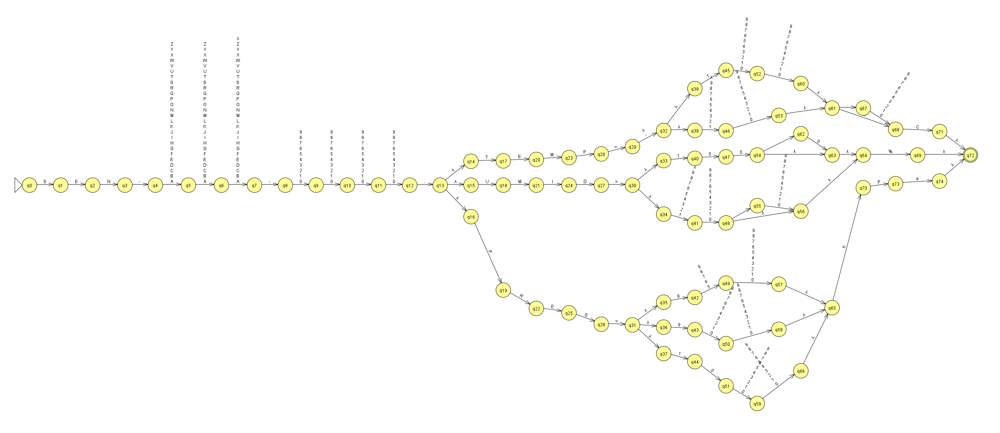
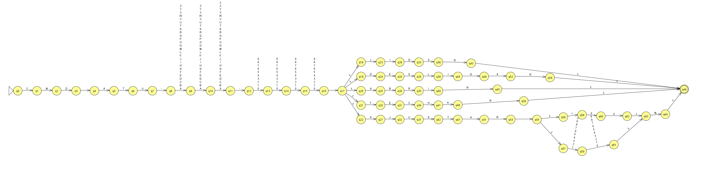
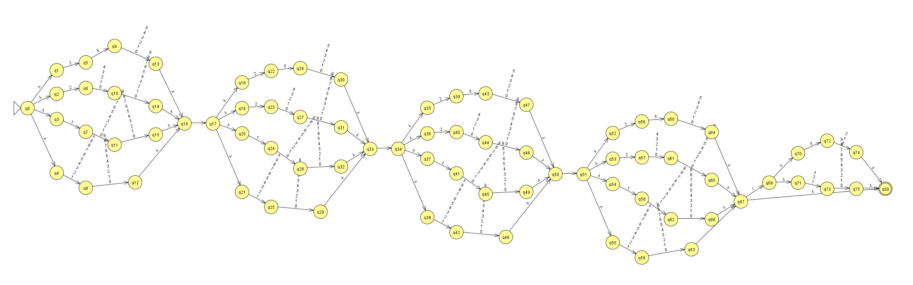
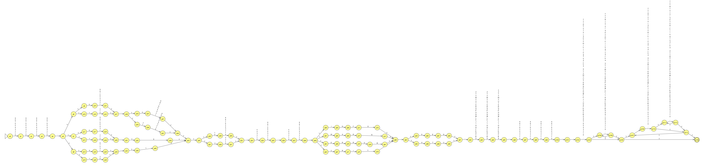

# Execução dos AFNε no motor do JFLAP 7.1

Gerado por `scripts/verificar_jflap.py`: cada `.jff` foi carregado pelo próprio JFLAP (`file.XMLCodec`) e simulado com `FSAStepWithClosureSimulator`, o simulador usado em *Input › Multiple Run*. As imagens em `imagens/` foram desenhadas pelo componente gráfico do JFLAP (`gui.viewer.AutomatonPane`).

**Resultado: 80/80 cadeias com o resultado esperado.**

## ER-01 — ID do Dispositivo

| # | Cadeia | Esperado | JFLAP | Confere |
| --: | :-- | :-: | :-: | :-: |
| 1 | `SEN-TM-0001` | ACEITA | ACEITA | ✅ |
| 2 | `ATU-VLV-0420` | ACEITA | ACEITA | ✅ |
| 3 | `SEN-ABC-1234` | ACEITA | ACEITA | ✅ |
| 4 | `ATU-XY-9999` | ACEITA | ACEITA | ✅ |
| 5 | `SEN-XX-0000` | ACEITA | ACEITA | ✅ |
| 6 | `SEN-PH-0750` | ACEITA | ACEITA | ✅ |
| 7 | `SEN-AA-0000` | ACEITA | ACEITA | ✅ |
| 8 | `ATU-ZZZ-9999` | ACEITA | ACEITA | ✅ |
| 9 | ε (vazia) | REJEITA | REJEITA | ✅ |
| 10 | `sen-tm-0001` | REJEITA | REJEITA | ✅ |
| 11 | `SEN-TM-00012` | REJEITA | REJEITA | ✅ |
| 12 | `SEN-TM-123` | REJEITA | REJEITA | ✅ |
| 13 | `ATU-A-1234` | REJEITA | REJEITA | ✅ |
| 14 | `SEN-ABCD-1234` | REJEITA | REJEITA | ✅ |
| 15 | `SENO-TM-0001` | REJEITA | REJEITA | ✅ |
| 16 | `SEN_TM_0001` | REJEITA | REJEITA | ✅ |

## ER-02 — Telemetria (medição física)

| # | Cadeia | Esperado | JFLAP | Confere |
| --: | :-- | :-: | :-: | :-: |
| 1 | `SEN-TM-0001:TEMP=25.5C` | ACEITA | ACEITA | ✅ |
| 2 | `SEN-TM-0001:TEMP=-10C` | ACEITA | ACEITA | ✅ |
| 3 | `SEN-TMP-0002:TEMP=-199.9C` | ACEITA | ACEITA | ✅ |
| 4 | `SEN-TM-0002:TEMP=199.9C` | ACEITA | ACEITA | ✅ |
| 5 | `SEN-AB-1234:UMID=100.0%` | ACEITA | ACEITA | ✅ |
| 6 | `SEN-AB-1234:UMID=0%` | ACEITA | ACEITA | ✅ |
| 7 | `SEN-YY-0000:PRES=850hPa` | ACEITA | ACEITA | ✅ |
| 8 | `SEN-XX-9999:PRES=1099hPa` | ACEITA | ACEITA | ✅ |
| 9 | `SEN-TM-0001:TEMP=200C` | REJEITA | REJEITA | ✅ |
| 10 | `SEN-TM-0001:UMID=100.5%` | REJEITA | REJEITA | ✅ |
| 11 | `SEN-TM-0001:PRES=849hPa` | REJEITA | REJEITA | ✅ |
| 12 | `SEN-TM-0001:PRES=1100hPa` | REJEITA | REJEITA | ✅ |
| 13 | `SEN-TM-0001:TEMP=25.55C` | REJEITA | REJEITA | ✅ |
| 14 | `SEN-TM-0001:TEMP=025C` | REJEITA | REJEITA | ✅ |
| 15 | `ATU-TM-0001:TEMP=25C` | REJEITA | REJEITA | ✅ |
| 16 | `SEN-TM-0001:TEMP=25F` | REJEITA | REJEITA | ✅ |

## ER-03 — Comando de Controle

| # | Cadeia | Esperado | JFLAP | Confere |
| --: | :-- | :-: | :-: | :-: |
| 1 | `CMD ATU-VLV-0420 LIGAR` | ACEITA | ACEITA | ✅ |
| 2 | `CMD ATU-VLV-0420 DESLIGAR` | ACEITA | ACEITA | ✅ |
| 3 | `CMD ATU-XX-1234 ABRIR` | ACEITA | ACEITA | ✅ |
| 4 | `CMD ATU-XX-1234 FECHAR` | ACEITA | ACEITA | ✅ |
| 5 | `CMD ATU-YY-9999 AJUSTAR 100%` | ACEITA | ACEITA | ✅ |
| 6 | `CMD ATU-YY-9999 AJUSTAR 0%` | ACEITA | ACEITA | ✅ |
| 7 | `CMD ATU-MTR-0007 AJUSTAR 75%` | ACEITA | ACEITA | ✅ |
| 8 | `CMD ATU-BB-0001 AJUSTAR 9%` | ACEITA | ACEITA | ✅ |
| 9 | `CMD ATU-VLV-0420 AJUSTAR 101%` | REJEITA | REJEITA | ✅ |
| 10 | `CMD SEN-VLV-0420 LIGAR` | REJEITA | REJEITA | ✅ |
| 11 | `CMD ATU-VLV-0420 PAUSAR` | REJEITA | REJEITA | ✅ |
| 12 | `CMD ATU-VLV-0420 AJUSTAR %` | REJEITA | REJEITA | ✅ |
| 13 | `CMD ATU-VLV-0420 LIGAR ` | REJEITA | REJEITA | ✅ |
| 14 | `CMD ATU-VLV-0420 AJUSTAR 050%` | REJEITA | REJEITA | ✅ |
| 15 | `cmd ATU-VLV-0420 LIGAR` | REJEITA | REJEITA | ✅ |
| 16 | `CMD ATU-VLV-0420 AJUSTAR 50` | REJEITA | REJEITA | ✅ |

## ER-04 — Rota de Rede IPv4/CIDR

| # | Cadeia | Esperado | JFLAP | Confere |
| --: | :-- | :-: | :-: | :-: |
| 1 | `192.168.0.1` | ACEITA | ACEITA | ✅ |
| 2 | `10.0.0.1/8` | ACEITA | ACEITA | ✅ |
| 3 | `255.255.255.255` | ACEITA | ACEITA | ✅ |
| 4 | `0.0.0.0` | ACEITA | ACEITA | ✅ |
| 5 | `172.16.254.1/32` | ACEITA | ACEITA | ✅ |
| 6 | `0.0.0.0/0` | ACEITA | ACEITA | ✅ |
| 7 | `192.168.1.0/24` | ACEITA | ACEITA | ✅ |
| 8 | `200.249.250.199` | ACEITA | ACEITA | ✅ |
| 9 | `256.0.0.1` | REJEITA | REJEITA | ✅ |
| 10 | `192.168.0.1/33` | REJEITA | REJEITA | ✅ |
| 11 | `192.168.0` | REJEITA | REJEITA | ✅ |
| 12 | `1.2.3.4.5` | REJEITA | REJEITA | ✅ |
| 13 | `192.168.01.1` | REJEITA | REJEITA | ✅ |
| 14 | `192.168.0.1/08` | REJEITA | REJEITA | ✅ |
| 15 | `10.0.0.1/` | REJEITA | REJEITA | ✅ |
| 16 | ε (vazia) | REJEITA | REJEITA | ✅ |

## ER-05 — Alerta de Log (severidade)

| # | Cadeia | Esperado | JFLAP | Confere |
| --: | :-- | :-: | :-: | :-: |
| 1 | `2026-09-30T08:15:00 INFO SEN-TM-0001: leitura normal` | ACEITA | ACEITA | ✅ |
| 2 | `2026-12-31T23:59:59 CRIT ATU-XX-9999: falha critica no motor` | ACEITA | ACEITA | ✅ |
| 3 | `2026-01-01T00:00:00 WARN SEN-AB-1234: bateria fraca` | ACEITA | ACEITA | ✅ |
| 4 | `2026-02-28T12:30:45 ERROR ATU-VLV-0420: travamento_123` | ACEITA | ACEITA | ✅ |
| 5 | `2028-02-29T06:00:00 INFO SEN-TM-0001: ok` | ACEITA | ACEITA | ✅ |
| 6 | `2026-04-30T10:00:00 WARN ATU-VLV-0420: valvula 80.5 aberta` | ACEITA | ACEITA | ✅ |
| 7 | `2026-07-31T18:45:00 ERROR SEN-PH-0750: sensor-ph fora_de_faixa` | ACEITA | ACEITA | ✅ |
| 8 | `2026-10-15T14:22:10 INFO SEN-ZZ-0000: .` | ACEITA | ACEITA | ✅ |
| 9 | `2026-13-01T10:00:00 INFO SEN-TM-0001: ok` | REJEITA | REJEITA | ✅ |
| 10 | `2026-02-30T10:00:00 INFO SEN-TM-0001: ok` | REJEITA | REJEITA | ✅ |
| 11 | `2026-04-31T10:00:00 INFO SEN-TM-0001: ok` | REJEITA | REJEITA | ✅ |
| 12 | `2026-09-30T24:00:00 INFO SEN-TM-0001: ok` | REJEITA | REJEITA | ✅ |
| 13 | `2026-09-30T08:15:00 DEBUG SEN-TM-0001: ok` | REJEITA | REJEITA | ✅ |
| 14 | `2026-09-30T08:15:00 INFO SEN-TM-0001: ` | REJEITA | REJEITA | ✅ |
| 15 | `2026-09-30T08:15:00 INFO SEN-TM-0001: leitura  dupla` | REJEITA | REJEITA | ✅ |
| 16 | `2026-09-30T08:15:00 INFO SEN-TM-0001: pressão alta` | REJEITA | REJEITA | ✅ |
