# Relatório Técnico — Auditor Léxico de Telemetria de Sensores Industriais

| | |
| :-- | :-- |
| **Disciplina** | Linguagens Formais e Autômatos — Trabalho do 1º Bimestre |
| **Curso** | Ciência da Computação — CESUPA |
| **Integrantes** | Augusto Rodrigues · Caue Jadão · César Augusto |
| **Linguagem** | Python 3.11+ (módulo `re`, sem bibliotecas externas na aplicação) |
| **Ferramentas** | pytest (testes), JFLAP 7.1 (AFNε), Graphviz (diagramas) |
| **Repositório** | <https://github.com/cauebarroso/Auditor-de-sensores-industriais-com-express-es-regulares> |

**Sumário:** 1. Problema e solução · 2. Notação adotada · 3. Fichas das Expressões Regulares ·
4. Consistência entre as representações · 5. Demonstração do AFNε · 6. Testes e análise dos resultados ·
7. Limitações e melhorias · 8. Contribuições · 9. Uso de Inteligência Artificial · 10. Referências

## 1. Problema e solução

Redes industriais (SCADA/IIoT) trocam pacotes de texto entre sensores, atuadores e o sistema
supervisório. Um pacote corrompido — um dígito trocado por uma letra, um mês inexistente, um
percentual acima de 100% — pode virar uma leitura falsa ou uma ordem perigosa para um atuador.

O **Auditor Léxico** é uma ferramenta de linha de comando que atua como um *firewall léxico*:
cada pacote só é aceito se pertencer à linguagem de uma das cinco Expressões Regulares do
protocolo. Pacotes rejeitados são bloqueados e recebem um diagnóstico com a causa provável e a
**coluna exata do erro**, obtida pela simulação do AFNε da ER.

| Código | Padrão | Finalidade |
| :-- | :-- | :-- |
| ER-01 | ID do Dispositivo | Validar o identificador único de um sensor (SEN) ou atuador (ATU) da rede. É também o bloco reutilizado dentro das ERs 02, 03 e 05. |
| ER-02 | Telemetria (medição física) | Validar a leitura enviada por um sensor: temperatura (°C), umidade relativa (%) ou pressão atmosférica (hPa), com a unidade correta e dentro da faixa do instrumento. |
| ER-03 | Comando de Controle | Validar ordens enviadas a ATUADORES: ligar, desligar, abrir, fechar ou ajustar a abertura/potência em percentual (0 a 100%). |
| ER-04 | Rota de Rede IPv4/CIDR | Validar o endereço IPv4 (ou a rota em notação CIDR) de um equipamento, bloqueando octetos acima de 255, zeros à esquerda e máscaras acima de /32. |
| ER-05 | Alerta de Log (severidade) | Validar registros de eventos com carimbo de tempo ISO 8601, nível de severidade, dispositivo de origem e mensagem descritiva. |

### Entradas, processamento e saídas

| Etapa | Descrição |
| :-- | :-- |
| **Entradas** | Pacotes digitados no modo interativo, passados por argumento (`--pacote`) ou lidos de um arquivo `.txt` (um pacote por linha; linhas em branco e comentários `#` são ignorados). |
| **Processamento** | Normalização (remoção de espaços nas extremidades), classificação por `re.fullmatch` contra as cinco ERs (linguagens disjuntas, logo a categoria é única), extração de campos dos pacotes válidos e diagnóstico dos inválidos. |
| **Saídas** | Veredito por pacote (`[OK]`/`[ERRO]` com apontador de coluna), relatório de conformidade (totais, taxa, categorias, estatísticas de telemetria, comandos, alertas, inventário de dispositivos), filtros por categoria e exportação em JSON, CSV ou TXT. |

Entradas vazias, só com espaços, arquivos inexistentes, pastas, arquivos vazios e arquivos que
não são texto UTF-8 são tratados com mensagens claras, sem encerrar o programa com erro.

### Organização do código

| Módulo | Responsabilidade |
| :-- | :-- |
| `src/expressoes.py` | As cinco ERs (padrões do código) e as fichas: alfabeto, linguagem e ER formal. |
| `src/auditor.py` | Interface: menu, modo interativo, modo lote, argumentos de linha de comando. |
| `src/diagnostico.py` | Causa provável da rejeição e localização do erro pela simulação do AFNε. |
| `src/relatorio.py` | Leitura de arquivos, extração de campos, estatísticas e exportação. |
| `src/afn.py` | Estrutura do AFNε: fecho-ε, simulação, linguagem finita/infinita, equivalência e interseção. |
| `src/construtor_afn.py` | Analisador do subconjunto regular permitido e construção de Thompson (ER → AFNε). |
| `src/jflap.py`, `src/diagramas.py` | Exportação/importação `.jff` e diagramas DOT. |
| `tests/` | Casos de teste (fonte única) e suítes pytest. |
| `scripts/` | Geração dos AFNε, verificação no JFLAP e geração deste relatório. |

## 2. Notação adotada

A ER formal segue a notação do guia da disciplina. Para que a escrita formal fique legível, as
subexpressões repetidas recebem nomes (**definições regulares**, escritas como `⟨NOME⟩ = r`); cada
nome é apenas uma abreviação da ER que ele define, então a linguagem descrita não muda.

| Notação formal | Significado | Equivalente no Python |
| :-- | :-- | :-- |
| `r s` | Concatenação | `rs` |
| `r \| s` | União | `r\|s` |
| `r*` | Fecho de Kleene (zero ou mais) | `r*` |
| `r r*` | Fecho positivo (uma ou mais) | `r+` |
| `(r \| ε)` | Opcionalidade | `r?` |
| `ε` | Cadeia vazia | (alternativa vazia) |
| `[0-9]`, `[A-Z]` | Classe/intervalo finito: `(0 \| 1 \| … \| 9)` | `[0-9]`, `[A-Z]` |
| `⎵` | O símbolo espaço | ` ` (espaço literal) |
| `.` | O símbolo ponto (na notação formal não existe curinga) | `\.` (escape obrigatório) |
| `⟨NOME⟩` | Definição regular | o padrão é escrito por extenso |

**Regras seguidas no código:** correspondência completa com `re.fullmatch` (dispensa `^` e `$`);
nenhum uso de `\d`, `\w`, `\s`, `.` curinga, classes negadas, retroreferências ou lookarounds.
O analisador de `src/construtor_afn.py` **rejeita** esses recursos, então a regra é verificada
automaticamente nos testes.

<div class="quebra"></div>

## 3. Fichas das Expressões Regulares

<div class="quebra"></div>

### ER-01 — ID do Dispositivo

| Campo | Conteúdo |
| :-- | :-- |
| **Identificação** | ER-01 · categoria `ID_DISPOSITIVO` · constante `ER_01_ID` em `src/expressoes.py` |
| **Finalidade** | Validar o identificador único de um sensor (SEN) ou atuador (ATU) da rede. É também o bloco reutilizado dentro das ERs 02, 03 e 05. |
| **Alfabeto** | Σ₁ = {A, …, Z} ∪ {0, …, 9} ∪ {-}   (37 símbolos) |
| **Linguagem L** | Cadeias formadas pela classe do dispositivo (SEN ou ATU), um hífen, o código do modelo com 2 ou 3 letras maiúsculas, um hífen e o número de série com exatamente 4 dígitos. L₁ é FINITA: |L₁| = 2 × (26² + 26³) × 10⁴ = 365.040.000 cadeias. |

**ER formal** (definições regulares seguidas da ER):

```text
⟨ID⟩ = (SEN | ATU) - [A-Z][A-Z]([A-Z] | ε) - [0-9][0-9][0-9][0-9]
ER01 = ⟨ID⟩
```

**Sintaxe implementada** (copiada do código, usada com `re.fullmatch`):

```python
PADRAO_ER_01 = r"(SEN|ATU)-[A-Z]{2,3}-[0-9]{4}"
```

**Equivalência entre o código e a notação formal:**

| No código | Na ER formal | Explicação |
| :-- | :-- | :-- |
| `(SEN\|ATU)` | `(SEN \| ATU)` | União de duas palavras. No AFNε: dois ramos abertos e fechados por movimentos ε. |
| `-` | `-` | Concatenação com o símbolo hífen (fora de uma classe, '-' não é operador). |
| `[A-Z]` | `[A-Z] = (A \| B \| … \| Z)` | Classe finita: união de 26 símbolos. No .jff, 26 transições paralelas. |
| `[A-Z]{2,3}` | `[A-Z][A-Z]([A-Z] \| ε)` | Repetição limitada: r{2,3} = rr \| rrr = rr(r \| ε). |
| `[0-9]{4}` | `[0-9][0-9][0-9][0-9]` | Repetição exata: r{4} é a concatenação de 4 cópias de r. |
| `re.fullmatch` | — | Exige que a cadeia inteira pertença a L (equivale às âncoras ^…$, que não são símbolos de Σ). |

**AFNε** — construído pela construção de Thompson a partir do padrão do código:
**19 estados** (inicial `q0`, final `q18`), **20 transições**,
das quais **5 são movimentos ε** (setas tracejadas). Rótulos como `[0-9]` resumem
transições paralelas; no arquivo do JFLAP elas aparecem expandidas (131 transições).
Arquivos: `automatos/jflap/ER-01.jff` e `automatos/diagramas/ER-01.svg`.


**Testes** (8 aceitas e 8 rejeitadas):

| # | Cadeia | Esperado | Justificativa |
| --: | :-- | :-- | :-- |
| 1 | `SEN-TM-0001` | ✅ aceita | Sensor com modelo de 2 letras |
| 2 | `ATU-VLV-0420` | ✅ aceita | Atuador com modelo de 3 letras |
| 3 | `SEN-ABC-1234` | ✅ aceita | Sensor com modelo de 3 letras |
| 4 | `ATU-XY-9999` | ✅ aceita | Maior número de série (9999) **(caso-limite)** |
| 5 | `SEN-XX-0000` | ✅ aceita | Menor número de série (0000) **(caso-limite)** |
| 6 | `SEN-PH-0750` | ✅ aceita | Sensor de pH |
| 7 | `SEN-AA-0000` | ✅ aceita | Menor cadeia de L₁ (11 símbolos) **(caso-limite)** |
| 8 | `ATU-ZZZ-9999` | ✅ aceita | Maior cadeia de L₁ (12 símbolos) **(caso-limite)** |
| 9 | ε (cadeia vazia) | ❌ rejeitada | Cadeia vazia ε não pertence a L₁ **(caso-limite)** |
| 10 | `sen-tm-0001` | ❌ rejeitada | Minúsculas não pertencem a Σ₁ |
| 11 | `SEN-TM-00012` | ❌ rejeitada | 5 dígitos: {4} exige exatamente 4 **(caso-limite)** |
| 12 | `SEN-TM-123` | ❌ rejeitada | Apenas 3 dígitos no número de série **(caso-limite)** |
| 13 | `ATU-A-1234` | ❌ rejeitada | Modelo com 1 letra (mínimo 2) **(caso-limite)** |
| 14 | `SEN-ABCD-1234` | ❌ rejeitada | Modelo com 4 letras (máximo 3) **(caso-limite)** |
| 15 | `SENO-TM-0001` | ❌ rejeitada | Prefixo SENO não pertence a (SEN | ATU) |
| 16 | `SEN_TM_0001` | ❌ rejeitada | Separador '_' não pertence a Σ₁ |

**Resultado e limites.** Todas as 16 cadeias obtiveram o resultado esperado em `re.fullmatch`,
no AFNε simulado em Python e no AFNε executado no JFLAP 7.1. A linguagem é **finita**.

- A validação é léxica: um ID bem formado é aceito mesmo que o dispositivo não exista no cadastro da planta.
- O número de série 0000 é aceito; reservá-lo exigiria apenas mais um ramo na união, mas não é regra do domínio adotado.


<div class="quebra"></div>

### ER-02 — Telemetria (medição física)

| Campo | Conteúdo |
| :-- | :-- |
| **Identificação** | ER-02 · categoria `TELEMETRIA` · constante `ER_02_TELEMETRIA` em `src/expressoes.py` |
| **Finalidade** | Validar a leitura enviada por um sensor: temperatura (°C), umidade relativa (%) ou pressão atmosférica (hPa), com a unidade correta e dentro da faixa do instrumento. |
| **Alfabeto** | Σ₂ = {A, …, Z} ∪ {0, …, 9} ∪ {-, :, =, ., %, h, a}   (43 símbolos) |
| **Linguagem L** | ID de um SENSOR (SEN), ':' e exatamente uma medição: TEMP= com sinal '-' opcional, inteiro de 0 a 199 sem zeros à esquerda, uma casa decimal opcional e a unidade C; UMID= com valor de 0 a 100 (uma casa decimal opcional; 100 só como 100 ou 100.0) e a unidade %; ou PRES= com inteiro de 850 a 1099 e a unidade hPa. L₂ é finita. |

**ER formal** (definições regulares seguidas da ER):

```text
⟨SID⟩ = SEN - [A-Z][A-Z]([A-Z] | ε) - [0-9][0-9][0-9][0-9]
⟨DEC⟩ = . [0-9] | ε
⟨TEMP⟩ = TEMP= (- | ε) (1[0-9][0-9] | ([1-9] | ε) [0-9]) ⟨DEC⟩ C
⟨UMID⟩ = UMID= (100 (.0 | ε) | ([1-9] | ε) [0-9] ⟨DEC⟩) %
⟨PRES⟩ = PRES= (8[5-9][0-9] | 9[0-9][0-9] | 10[0-9][0-9]) hPa
ER02 = ⟨SID⟩ : (⟨TEMP⟩ | ⟨UMID⟩ | ⟨PRES⟩)
```

**Sintaxe implementada** (copiada do código, usada com `re.fullmatch`):

```python
PADRAO_ER_02 = r"SEN-[A-Z]{2,3}-[0-9]{4}:(TEMP=-?(1[0-9][0-9]|[1-9]?[0-9])(\.[0-9])?C|UMID=(100(\.0)?|[1-9]?[0-9](\.[0-9])?)%|PRES=(8[5-9][0-9]|9[0-9][0-9]|10[0-9][0-9])hPa)"
```

**Equivalência entre o código e a notação formal:**

| No código | Na ER formal | Explicação |
| :-- | :-- | :-- |
| `SEN-[A-Z]{2,3}-[0-9]{4}` | `⟨SID⟩` | ID restrito a sensores: o ramo ATU da ER-01 é removido. |
| `(TEMP=…\|UMID=…\|PRES=…)` | `(⟨TEMP⟩ \| ⟨UMID⟩ \| ⟨PRES⟩)` | União de três ramos, um por grandeza física. |
| `-?` | `(- \| ε)` | Opcionalidade: r? = (r \| ε). Permite temperatura negativa. |
| `1[0-9][0-9]` | `1[0-9][0-9]` | Inteiros de 100 a 199. |
| `[1-9]?[0-9]` | `([1-9] \| ε)[0-9]` | Inteiros de 0 a 99 sem zero à esquerda (rejeita 05). |
| `(\.[0-9])?` | `⟨DEC⟩ = .[0-9] \| ε` | Casa decimal opcional. O escape \. torna o ponto literal; sem ele, '.' seria qualquer caractere. |
| `100(\.0)?` | `100(.0 \| ε)` | Umidade máxima: só 100 ou 100.0 (rejeita 100.5). |
| `8[5-9][0-9]\|9[0-9][0-9]\|10[0-9][0-9]` | `8[5-9][0-9] \| 9[0-9][0-9] \| 10[0-9][0-9]` | Pressão de 850 a 1099 hPa: três intervalos disjuntos. |

**AFNε** — construído pela construção de Thompson a partir do padrão do código:
**75 estados** (inicial `q0`, final `q72`), **87 transições**,
das quais **27 são movimentos ε** (setas tracejadas). Rótulos como `[0-9]` resumem
transições paralelas; no arquivo do JFLAP elas aparecem expandidas (317 transições).
Arquivos: `automatos/jflap/ER-02.jff` e `automatos/diagramas/ER-02.svg`.

O diagrama foi dividido em 2 partes nos estados de articulação (estados por onde passa todo caminho de aceitação); a seta pontilhada indica a continuação. A numeração dos estados é a do autômato completo.

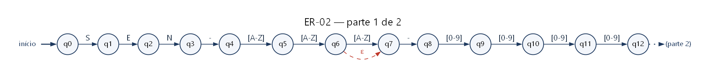

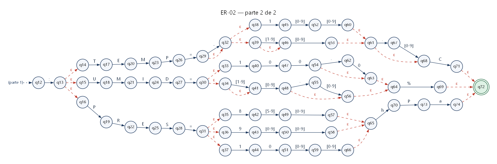

**Testes** (8 aceitas e 8 rejeitadas):

| # | Cadeia | Esperado | Justificativa |
| --: | :-- | :-- | :-- |
| 1 | `SEN-TM-0001:TEMP=25.5C` | ✅ aceita | Temperatura típica com uma casa decimal |
| 2 | `SEN-TM-0001:TEMP=-10C` | ✅ aceita | Temperatura negativa sem casa decimal |
| 3 | `SEN-TMP-0002:TEMP=-199.9C` | ✅ aceita | Menor temperatura da faixa **(caso-limite)** |
| 4 | `SEN-TM-0002:TEMP=199.9C` | ✅ aceita | Maior temperatura da faixa **(caso-limite)** |
| 5 | `SEN-AB-1234:UMID=100.0%` | ✅ aceita | Umidade máxima (100.0) **(caso-limite)** |
| 6 | `SEN-AB-1234:UMID=0%` | ✅ aceita | Umidade mínima (0) **(caso-limite)** |
| 7 | `SEN-YY-0000:PRES=850hPa` | ✅ aceita | Menor pressão da faixa **(caso-limite)** |
| 8 | `SEN-XX-9999:PRES=1099hPa` | ✅ aceita | Maior pressão da faixa **(caso-limite)** |
| 9 | `SEN-TM-0001:TEMP=200C` | ❌ rejeitada | 200 > 199: fora da faixa **(caso-limite)** |
| 10 | `SEN-TM-0001:UMID=100.5%` | ❌ rejeitada | 100.5% > 100%: fora da faixa **(caso-limite)** |
| 11 | `SEN-TM-0001:PRES=849hPa` | ❌ rejeitada | 849 < 850: fora da faixa **(caso-limite)** |
| 12 | `SEN-TM-0001:PRES=1100hPa` | ❌ rejeitada | 1100 > 1099: fora da faixa **(caso-limite)** |
| 13 | `SEN-TM-0001:TEMP=25.55C` | ❌ rejeitada | Duas casas decimais (máximo uma) |
| 14 | `SEN-TM-0001:TEMP=025C` | ❌ rejeitada | Zero à esquerda não é permitido |
| 15 | `ATU-TM-0001:TEMP=25C` | ❌ rejeitada | Atuador (ATU) não emite telemetria |
| 16 | `SEN-TM-0001:TEMP=25F` | ❌ rejeitada | Unidade F não pertence à linguagem (só C) |

**Resultado e limites.** Todas as 16 cadeias obtiveram o resultado esperado em `re.fullmatch`,
no AFNε simulado em Python e no AFNε executado no JFLAP 7.1. A linguagem é **finita**.

- Possível falso positivo: −0C e −0.0C (zero negativo) são aceitos, pois o sinal opcional precede qualquer valor.
- Possível falso negativo: leituras legítimas fora da faixa (ex.: caldeira acima de 199.9 °C) são bloqueadas; a faixa é fixa na ER.
- Umidade 100.00 é rejeitada (no máximo uma casa decimal); a ER não verifica coerência física entre leituras.


<div class="quebra"></div>

### ER-03 — Comando de Controle

| Campo | Conteúdo |
| :-- | :-- |
| **Identificação** | ER-03 · categoria `COMANDO` · constante `ER_03_COMANDO` em `src/expressoes.py` |
| **Finalidade** | Validar ordens enviadas a ATUADORES: ligar, desligar, abrir, fechar ou ajustar a abertura/potência em percentual (0 a 100%). |
| **Alfabeto** | Σ₃ = {A, …, Z} ∪ {0, …, 9} ∪ {-, ⎵, %}   (39 símbolos) |
| **Linguagem L** | O prefixo 'CMD', um espaço, o ID de um ATUADOR (ATU), um espaço e exatamente uma ação: LIGAR, DESLIGAR, ABRIR, FECHAR ou 'AJUSTAR ' seguido de um inteiro de 0 a 100 sem zeros à esquerda e do símbolo %. L₃ é finita. |

**ER formal** (definições regulares seguidas da ER):

```text
⟨AID⟩ = ATU - [A-Z][A-Z]([A-Z] | ε) - [0-9][0-9][0-9][0-9]
⟨PCT⟩ = 100 | ([1-9] | ε) [0-9]
ER03 = CMD ⎵ ⟨AID⟩ ⎵ (LIGAR | DESLIGAR | ABRIR | FECHAR | AJUSTAR ⎵ ⟨PCT⟩ %)
```

**Sintaxe implementada** (copiada do código, usada com `re.fullmatch`):

```python
PADRAO_ER_03 = r"CMD ATU-[A-Z]{2,3}-[0-9]{4} (LIGAR|DESLIGAR|ABRIR|FECHAR|AJUSTAR (100|[1-9]?[0-9])%)"
```

**Equivalência entre o código e a notação formal:**

| No código | Na ER formal | Explicação |
| :-- | :-- | :-- |
| ` (espaço)` | `⎵` | O espaço é um símbolo de Σ₃. Não usamos \s, que também aceitaria tabulação e quebra de linha. |
| `ATU-[A-Z]{2,3}-[0-9]{4}` | `⟨AID⟩` | ID restrito a atuadores. |
| `(LIGAR\|DESLIGAR\|ABRIR\|FECHAR\|AJUSTAR …)` | `(LIGAR \| DESLIGAR \| ABRIR \| FECHAR \| AJUSTAR ⎵ ⟨PCT⟩ %)` | União de cinco ações. No AFNε: cinco ramos a partir de um estado, por movimentos ε. |
| `(100\|[1-9]?[0-9])` | `⟨PCT⟩ = 100 \| ([1-9] \| ε)[0-9]` | Percentual de 0 a 100 sem zero à esquerda. |
| `%` | `%` | Símbolo literal que encerra o ajuste. |

**AFNε** — construído pela construção de Thompson a partir do padrão do código:
**65 estados** (inicial `q0`, final `q48`), **71 transições**,
das quais **16 são movimentos ε** (setas tracejadas). Rótulos como `[0-9]` resumem
transições paralelas; no arquivo do JFLAP elas aparecem expandidas (199 transições).
Arquivos: `automatos/jflap/ER-03.jff` e `automatos/diagramas/ER-03.svg`.

O diagrama foi dividido em 2 partes nos estados de articulação (estados por onde passa todo caminho de aceitação); a seta pontilhada indica a continuação. A numeração dos estados é a do autômato completo.

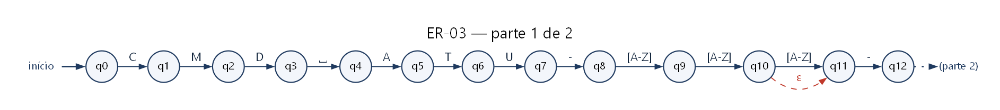

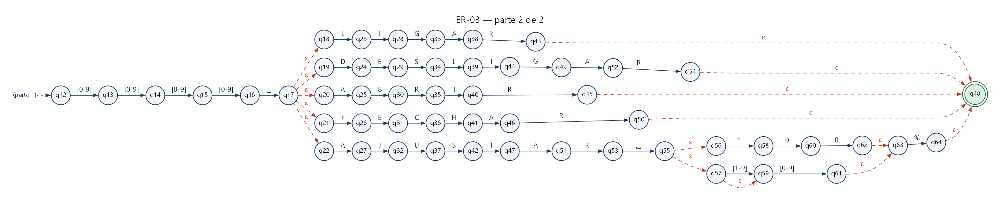

**Testes** (8 aceitas e 8 rejeitadas):

| # | Cadeia | Esperado | Justificativa |
| --: | :-- | :-- | :-- |
| 1 | `CMD ATU-VLV-0420 LIGAR` | ✅ aceita | Ação LIGAR |
| 2 | `CMD ATU-VLV-0420 DESLIGAR` | ✅ aceita | Ação DESLIGAR |
| 3 | `CMD ATU-XX-1234 ABRIR` | ✅ aceita | Ação ABRIR |
| 4 | `CMD ATU-XX-1234 FECHAR` | ✅ aceita | Ação FECHAR |
| 5 | `CMD ATU-YY-9999 AJUSTAR 100%` | ✅ aceita | Maior ajuste (100%) **(caso-limite)** |
| 6 | `CMD ATU-YY-9999 AJUSTAR 0%` | ✅ aceita | Menor ajuste (0%) **(caso-limite)** |
| 7 | `CMD ATU-MTR-0007 AJUSTAR 75%` | ✅ aceita | Ajuste com 2 dígitos |
| 8 | `CMD ATU-BB-0001 AJUSTAR 9%` | ✅ aceita | Ajuste com 1 dígito |
| 9 | `CMD ATU-VLV-0420 AJUSTAR 101%` | ❌ rejeitada | 101 > 100: fora da faixa **(caso-limite)** |
| 10 | `CMD SEN-VLV-0420 LIGAR` | ❌ rejeitada | Sensor (SEN) não recebe comandos |
| 11 | `CMD ATU-VLV-0420 PAUSAR` | ❌ rejeitada | PAUSAR não pertence à união de ações |
| 12 | `CMD ATU-VLV-0420 AJUSTAR %` | ❌ rejeitada | Valor percentual ausente |
| 13 | `CMD ATU-VLV-0420 LIGAR⎵` | ❌ rejeitada | Espaço extra no final **(caso-limite)** |
| 14 | `CMD ATU-VLV-0420 AJUSTAR 050%` | ❌ rejeitada | Zero à esquerda não é permitido |
| 15 | `cmd ATU-VLV-0420 LIGAR` | ❌ rejeitada | Prefixo em minúsculas |
| 16 | `CMD ATU-VLV-0420 AJUSTAR 50` | ❌ rejeitada | Falta o símbolo % |

**Resultado e limites.** Todas as 16 cadeias obtiveram o resultado esperado em `re.fullmatch`,
no AFNε simulado em Python e no AFNε executado no JFLAP 7.1. A linguagem é **finita**.

- Não verifica se o atuador suporta a ação (ex.: AJUSTAR em uma bomba que só liga/desliga) nem o estado atual do equipamento.
- O espaço é exatamente um; comandos com espaços duplos são rejeitados (o programa só remove espaços nas extremidades da linha).


<div class="quebra"></div>

### ER-04 — Rota de Rede IPv4/CIDR

| Campo | Conteúdo |
| :-- | :-- |
| **Identificação** | ER-04 · categoria `IPV4_CIDR` · constante `ER_04_IPV4_CIDR` em `src/expressoes.py` |
| **Finalidade** | Validar o endereço IPv4 (ou a rota em notação CIDR) de um equipamento, bloqueando octetos acima de 255, zeros à esquerda e máscaras acima de /32. |
| **Alfabeto** | Σ₄ = {0, …, 9} ∪ {., /}   (12 símbolos) |
| **Linguagem L** | Quatro octetos decimais de 0 a 255, sem zeros à esquerda, separados por '.', seguidos opcionalmente de '/' e de uma máscara de 0 a 32. L₄ é finita: 256⁴ × (1 + 33) endereços/rotas. |

**ER formal** (definições regulares seguidas da ER):

```text
⟨OCT⟩ = 25[0-5] | 2[0-4][0-9] | 1[0-9][0-9] | ([1-9] | ε) [0-9]
⟨MASC⟩ = 3[0-2] | ([12] | ε) [0-9]
ER04 = ⟨OCT⟩ . ⟨OCT⟩ . ⟨OCT⟩ . ⟨OCT⟩ (/ ⟨MASC⟩ | ε)
```

**Sintaxe implementada** (copiada do código, usada com `re.fullmatch`):

```python
PADRAO_ER_04 = r"((25[0-5]|2[0-4][0-9]|1[0-9][0-9]|[1-9]?[0-9])\.){3}(25[0-5]|2[0-4][0-9]|1[0-9][0-9]|[1-9]?[0-9])(/(3[0-2]|[12]?[0-9]))?"
```

**Equivalência entre o código e a notação formal:**

| No código | Na ER formal | Explicação |
| :-- | :-- | :-- |
| `(25[0-5]\|2[0-4][0-9]\|1[0-9][0-9]\|[1-9]?[0-9])` | `⟨OCT⟩` | Octeto de 0 a 255 dividido em faixas disjuntas: 250–255, 200–249, 100–199 e 0–99. |
| `(…\.){3}` | `⟨OCT⟩.⟨OCT⟩.⟨OCT⟩.` | Repetição exata de um grupo: 3 cópias de (octeto seguido de ponto). |
| `\.` | `.` | Escape: o ponto do código vira o símbolo literal '.' do alfabeto. |
| `(/(3[0-2]\|[12]?[0-9]))?` | `(/⟨MASC⟩ \| ε)` | Máscara CIDR opcional de /0 a /32. |

**Fonte.** A divisão do octeto em faixas disjuntas (250–255, 200–249, 100–199, 0–99) é uma construção clássica, descrita em Goyvaerts e Levithan (2012). A equipe acrescentou a máscara CIDR, a proibição de zeros à esquerda na máscara, a ER formal e o AFNε.

**AFNε** — construído pela construção de Thompson a partir do padrão do código:
**76 estados** (inicial `q0`, final `q69`), **94 transições**,
das quais **42 são movimentos ε** (setas tracejadas). Rótulos como `[0-9]` resumem
transições paralelas; no arquivo do JFLAP elas aparecem expandidas (318 transições).
Arquivos: `automatos/jflap/ER-04.jff` e `automatos/diagramas/ER-04.svg`.

O diagrama foi dividido em 3 partes nos estados de articulação (estados por onde passa todo caminho de aceitação); a seta pontilhada indica a continuação. A numeração dos estados é a do autômato completo.

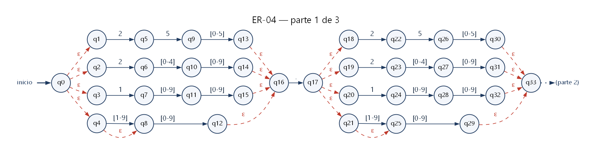

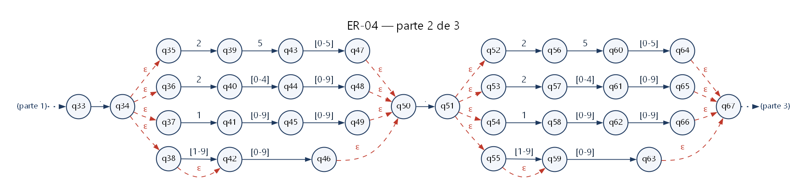

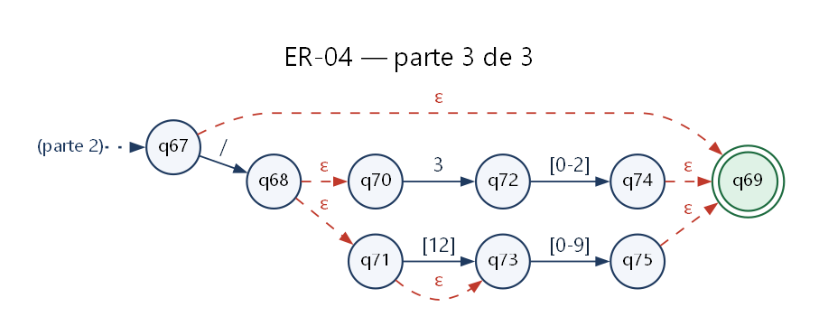

**Testes** (8 aceitas e 8 rejeitadas):

| # | Cadeia | Esperado | Justificativa |
| --: | :-- | :-- | :-- |
| 1 | `192.168.0.1` | ✅ aceita | IP privado sem máscara |
| 2 | `10.0.0.1/8` | ✅ aceita | IP com máscara CIDR |
| 3 | `255.255.255.255` | ✅ aceita | Maior octeto em todas as posições **(caso-limite)** |
| 4 | `0.0.0.0` | ✅ aceita | Menor octeto em todas as posições **(caso-limite)** |
| 5 | `172.16.254.1/32` | ✅ aceita | Maior máscara (/32) **(caso-limite)** |
| 6 | `0.0.0.0/0` | ✅ aceita | Menor máscara (/0): rota padrão **(caso-limite)** |
| 7 | `192.168.1.0/24` | ✅ aceita | Rede /24 |
| 8 | `200.249.250.199` | ✅ aceita | Usa os ramos 2[0-4]D, 25[0-5] e 1DD do octeto |
| 9 | `256.0.0.1` | ❌ rejeitada | 256 > 255: octeto fora da faixa **(caso-limite)** |
| 10 | `192.168.0.1/33` | ❌ rejeitada | Máscara 33 > 32 **(caso-limite)** |
| 11 | `192.168.0` | ❌ rejeitada | Apenas 3 octetos |
| 12 | `1.2.3.4.5` | ❌ rejeitada | 5 octetos |
| 13 | `192.168.01.1` | ❌ rejeitada | Zero à esquerda no octeto |
| 14 | `192.168.0.1/08` | ❌ rejeitada | Zero à esquerda na máscara |
| 15 | `10.0.0.1/` | ❌ rejeitada | Barra sem máscara |
| 16 | ε (cadeia vazia) | ❌ rejeitada | Cadeia vazia ε não pertence a L₄ **(caso-limite)** |

**Resultado e limites.** Todas as 16 cadeias obtiveram o resultado esperado em `re.fullmatch`,
no AFNε simulado em Python e no AFNε executado no JFLAP 7.1. A linguagem é **finita**.

- Endereços reservados (0.0.0.0, 255.255.255.255) são aceitos: a ER valida a forma, não o uso do endereço.
- Não confere se o endereço é a rede da máscara (10.0.0.1/8 é aceito embora a rede seja 10.0.0.0/8).


<div class="quebra"></div>

### ER-05 — Alerta de Log (severidade)

| Campo | Conteúdo |
| :-- | :-- |
| **Identificação** | ER-05 · categoria `ALERTA_LOG` · constante `ER_05_ALERTA_LOG` em `src/expressoes.py` |
| **Finalidade** | Validar registros de eventos com carimbo de tempo ISO 8601, nível de severidade, dispositivo de origem e mensagem descritiva. |
| **Alfabeto** | Σ₅ = {A, …, Z} ∪ {a, …, z} ∪ {0, …, 9} ∪ {-, :, ⎵, _, .}   (67 símbolos) |
| **Linguagem L** | Data AAAA-MM-DD com dia válido para o mês (fevereiro até 29; abril, junho, setembro e novembro até 30; os demais até 31), 'T', hora hh:mm:ss (00:00:00 a 23:59:59), espaço, nível de severidade (INFO, WARN, ERROR ou CRIT), espaço, ID do dispositivo, ': ' e uma mensagem formada por uma ou mais palavras de [A-Za-z0-9_.-] separadas por exatamente um espaço. L₅ é INFINITA, pois a mensagem usa o fecho de Kleene. |

**ER formal** (definições regulares seguidas da ER):

```text
⟨DATA⟩ = [0-9][0-9][0-9][0-9] - ((0[1-9] | 1[0-2]) - (0[1-9] | [12][0-9]) | (0[13-9] | 1[0-2]) - 30 | (0[13578] | 1[02]) - 31)
⟨HORA⟩ = ([01][0-9] | 2[0-3]) : [0-5][0-9] : [0-5][0-9]
⟨SEV⟩ = INFO | WARN | ERROR | CRIT
⟨ID⟩ = (SEN | ATU) - [A-Z][A-Z]([A-Z] | ε) - [0-9][0-9][0-9][0-9]
⟨PAL⟩ = [A-Za-z0-9_.-] [A-Za-z0-9_.-]*
⟨MSG⟩ = ⟨PAL⟩ (⎵ ⟨PAL⟩)*
ER05 = ⟨DATA⟩ T ⟨HORA⟩ ⎵ ⟨SEV⟩ ⎵ ⟨ID⟩ : ⎵ ⟨MSG⟩
```

**Sintaxe implementada** (copiada do código, usada com `re.fullmatch`):

```python
PADRAO_ER_05 = r"[0-9]{4}-((0[1-9]|1[0-2])-(0[1-9]|[12][0-9])|(0[13-9]|1[0-2])-30|(0[13578]|1[02])-31)T([01][0-9]|2[0-3]):[0-5][0-9]:[0-5][0-9] (INFO|WARN|ERROR|CRIT) (SEN|ATU)-[A-Z]{2,3}-[0-9]{4}: [A-Za-z0-9_.-]+( [A-Za-z0-9_.-]+)*"
```

**Equivalência entre o código e a notação formal:**

| No código | Na ER formal | Explicação |
| :-- | :-- | :-- |
| `[0-9]{4}` | `[0-9][0-9][0-9][0-9]` | Ano com 4 dígitos (repetição exata). |
| `((0[1-9]\|1[0-2])-(0[1-9]\|[12][0-9])\|(0[13-9]\|1[0-2])-30\|(0[13578]\|1[02])-31)` | `MM-DD de ⟨DATA⟩` | União de três casos: dias 01–29 em qualquer mês; dia 30 exceto fevereiro; dia 31 só nos meses de 31 dias. |
| `([01][0-9]\|2[0-3])` | `([01][0-9] \| 2[0-3])` | Hora de 00 a 23. |
| `[0-5][0-9]` | `[0-5][0-9]` | Minuto e segundo de 00 a 59. |
| `(INFO\|WARN\|ERROR\|CRIT)` | `⟨SEV⟩` | União dos quatro níveis de severidade. |
| `(SEN\|ATU)-[A-Z]{2,3}-[0-9]{4}` | `⟨ID⟩` | Reuso da ER-01: linguagens regulares são fechadas sob concatenação. |
| `[A-Za-z0-9_.-]+` | `⟨PAL⟩ = c c*` | Fecho positivo: r+ = rr*. Dentro da classe, '.' é literal e o '-' final também. |
| `( [A-Za-z0-9_.-]+)*` | `(⎵⟨PAL⟩)*` | Fecho de Kleene: zero ou mais palavras adicionais, cada uma precedida de um espaço. |

**Fonte.** Validar o dia de acordo com o mês por uma união de casos é a abordagem descrita em Goyvaerts e Levithan (2012) para datas; aqui ela foi adaptada ao formato ISO 8601 e combinada com hora, severidade, ID do dispositivo e mensagem do protocolo.

**AFNε** — construído pela construção de Thompson a partir do padrão do código:
**114 estados** (inicial `q0`, final `q108`), **131 transições**,
das quais **51 são movimentos ε** (setas tracejadas). Rótulos como `[0-9]` resumem
transições paralelas; no arquivo do JFLAP elas aparecem expandidas (617 transições).
Arquivos: `automatos/jflap/ER-05.jff` e `automatos/diagramas/ER-05.svg`.

O diagrama foi dividido em 4 partes nos estados de articulação (estados por onde passa todo caminho de aceitação); a seta pontilhada indica a continuação. A numeração dos estados é a do autômato completo.

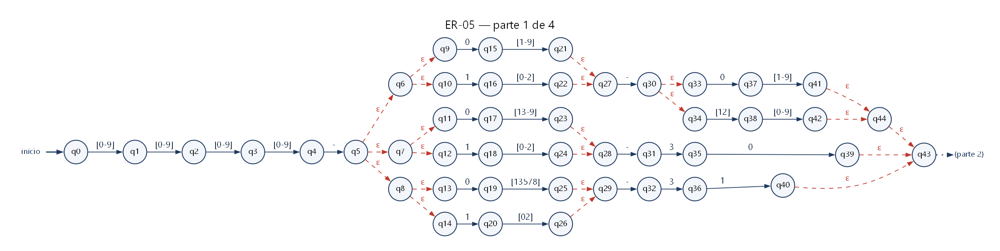

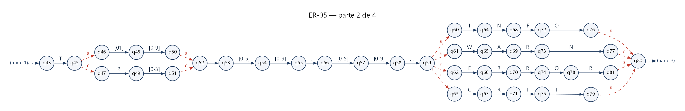

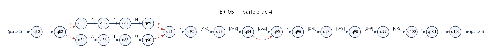

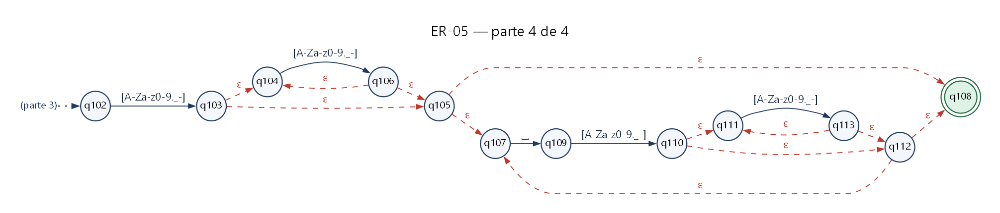

**Testes** (8 aceitas e 8 rejeitadas):

| # | Cadeia | Esperado | Justificativa |
| --: | :-- | :-- | :-- |
| 1 | `2026-09-30T08:15:00 INFO SEN-TM-0001: leitura normal` | ✅ aceita | Registro informativo típico |
| 2 | `2026-12-31T23:59:59 CRIT ATU-XX-9999: falha critica no motor` | ✅ aceita | Último segundo do ano **(caso-limite)** |
| 3 | `2026-01-01T00:00:00 WARN SEN-AB-1234: bateria fraca` | ✅ aceita | Primeiro instante do ano **(caso-limite)** |
| 4 | `2026-02-28T12:30:45 ERROR ATU-VLV-0420: travamento_123` | ✅ aceita | Mensagem com _ e dígitos |
| 5 | `2028-02-29T06:00:00 INFO SEN-TM-0001: ok` | ✅ aceita | 29 de fevereiro **(caso-limite)** |
| 6 | `2026-04-30T10:00:00 WARN ATU-VLV-0420: valvula 80.5 aberta` | ✅ aceita | Dia 30 em mês de 30 dias **(caso-limite)** |
| 7 | `2026-07-31T18:45:00 ERROR SEN-PH-0750: sensor-ph fora_de_faixa` | ✅ aceita | Dia 31 em mês de 31 dias **(caso-limite)** |
| 8 | `2026-10-15T14:22:10 INFO SEN-ZZ-0000: .` | ✅ aceita | Mensagem de 1 símbolo **(caso-limite)** |
| 9 | `2026-13-01T10:00:00 INFO SEN-TM-0001: ok` | ❌ rejeitada | Mês 13 não existe **(caso-limite)** |
| 10 | `2026-02-30T10:00:00 INFO SEN-TM-0001: ok` | ❌ rejeitada | 30 de fevereiro não existe **(caso-limite)** |
| 11 | `2026-04-31T10:00:00 INFO SEN-TM-0001: ok` | ❌ rejeitada | 31 de abril não existe **(caso-limite)** |
| 12 | `2026-09-30T24:00:00 INFO SEN-TM-0001: ok` | ❌ rejeitada | Hora 24 (máximo 23) **(caso-limite)** |
| 13 | `2026-09-30T08:15:00 DEBUG SEN-TM-0001: ok` | ❌ rejeitada | DEBUG não pertence à união de severidades |
| 14 | `2026-09-30T08:15:00 INFO SEN-TM-0001:⎵` | ❌ rejeitada | Mensagem vazia **(caso-limite)** |
| 15 | `2026-09-30T08:15:00 INFO SEN-TM-0001: leitura  dupla` | ❌ rejeitada | Dois espaços seguidos na mensagem |
| 16 | `2026-09-30T08:15:00 INFO SEN-TM-0001: pressão alta` | ❌ rejeitada | 'ã' não pertence a Σ₅ |

**Resultado e limites.** Todas as 16 cadeias obtiveram o resultado esperado em `re.fullmatch`,
no AFNε simulado em Python e no AFNε executado no JFLAP 7.1. A linguagem é **infinita**.

- 29 de fevereiro é aceito em qualquer ano. Verificar ano bissexto também seria REGULAR (o ano tem 4 dígitos, logo o conjunto é finito), mas multiplicaria o tamanho do AFNε.
- Ano 0000 é aceito; não há fuso horário (o carimbo é tratado como hora local da planta).
- A mensagem usa apenas ASCII (sem acentos) e não tem limite de tamanho: L₅ é infinita.

<div class="quebra"></div>

## 4. Consistência entre as representações

A regra central do guia exige que ER formal, padrão do código, testes e AFNε descrevam **a mesma
linguagem**. Em vez de conferir isso manualmente, o projeto verifica a regra por algoritmo:

1. **Código → AFNε (construção de Thompson).** `construtor_afn.py` lê o padrão exatamente como está
   no código e constrói o AFNε: união vira ramos abertos e fechados por ε; `r?` ganha um desvio ε;
   `r*` ganha o laço ε de Thompson; `r{m,n}` vira m cópias seguidas de n − m cópias opcionais.
2. **AFNε ≡ ER formal (prova).** A ER formal de cada ficha é traduzida para a sintaxe do Python e
   também convertida em AFNε. `afn.contraexemplo` percorre em largura todos os pares de conjuntos
   de estados alcançáveis pela mesma cadeia nos dois autômatos (construção de subconjuntos sobre o
   produto). Como esse espaço é finito, a busca termina: se nenhum par discorda sobre aceitação,
   as linguagens são **iguais** — é uma prova, não uma amostragem.
3. **`.jff` ≡ código (prova).** O arquivo do JFLAP é lido de volta e comparado com o AFNε do código
   pelo mesmo algoritmo.
4. **AFNε × `re.fullmatch` (testes).** Os 80 casos de teste e mais 10.000 cadeias aleatórias
   (caminhadas no autômato e mutações) dão o mesmo resultado no AFNε e no `re` do Python.
5. **No próprio JFLAP.** `scripts/verificar_jflap.py` carrega cada `.jff` com o código do JFLAP 7.1
   e simula as cadeias de teste: **80/80** com o resultado esperado.

| ER | ER formal ≡ código | `.jff` ≡ código | AFNε × `re` | JFLAP 7.1 | Linguagens disjuntas |
| :-- | :-: | :-: | :-: | :-: | :-: |
| ER-01 | ✅ provado | ✅ provado | ✅ | ✅ 16/16 | ✅ |
| ER-02 | ✅ provado | ✅ provado | ✅ | ✅ 16/16 | ✅ |
| ER-03 | ✅ provado | ✅ provado | ✅ | ✅ 16/16 | ✅ |
| ER-04 | ✅ provado | ✅ provado | ✅ | ✅ 16/16 | ✅ |
| ER-05 | ✅ provado | ✅ provado | ✅ | ✅ 16/16 | ✅ |

As cinco linguagens são **disjuntas** (a interseção de cada par de AFNε é vazia, também verificada
por busca no produto). Por isso cada pacote válido pertence a exatamente uma categoria.

**Observações sobre o JFLAP 7.1.** A execução no motor do JFLAP revelou dois comportamentos que
orientaram o formato dos arquivos:

- O simulador interpreta qualquer rótulo que contenha `[` como um intervalo no estilo `[a-z]` e lança
  uma exceção quando o rótulo é apenas `[`. Por isso a severidade do log é escrita sem colchetes
  (`INFO`, não `[INFO]`): o `.jff` reconhece exatamente a mesma linguagem do código, sem símbolos
  substitutos.
- Rótulos de intervalo como `[A-Z]` deixariam o desenho mais limpo, mas, depois de uma transição desse
  tipo, o simulador do JFLAP 7.1 **não aplica o fecho-ε**: testamos uma versão com intervalos e ela
  rejeitou 35 das 40 cadeias que deveriam ser aceitas (por exemplo, todo ID com modelo de 2 letras,
  que depende do desvio ε da terceira letra). Por isso os `.jff` usam uma transição por símbolo, o
  formato básico que funciona em qualquer versão do JFLAP e em todas as suas operações.

A pasta `automatos/jflap/imagens/` mostra cada `.jff` desenhado pelo próprio componente gráfico do JFLAP.

<div class="quebra"></div>

## 5. Demonstração: simulação do AFNε

A opção 3 do menu (ou `python src/auditor.py --explicar "PACOTE"`) mostra o conjunto de estados
ativos do AFNε após cada símbolo — o fecho-ε de δ(S, a). A cadeia é aceita se o último conjunto
contém um estado final. Os números dos estados são os mesmos do diagrama da ER-01.

**Cadeia aceita:**

```text

  Simulação do AFNε da ER-01 (ID do Dispositivo): 19 estados, 5 movimentos ε
  Cadeia: "ATU-VLV-0420"  (|w| = 12)

  passo   lido   conjunto de estados ativos (após o fecho-ε)
      0    —     {q0, q1, q2}
      1   'A'    {q4}
      2   'T'    {q6}
      3   'U'    {q8, q9}
      4   '-'    {q10}
      5   'V'    {q11}
      6   'L'    {q12, q13}
      7   'V'    {q13}
      8   '-'    {q14}
      9   '0'    {q15}
     10   '4'    {q16}
     11   '2'    {q17}
     12   '0'    {q18}

  Resultado: ACEITA — o último conjunto contém o estado final (q18).
```

**Cadeia rejeitada** (o modelo tem uma só letra; depois de `A`, o AFNε exige outra letra):

```text

  Simulação do AFNε da ER-01 (ID do Dispositivo): 19 estados, 5 movimentos ε
  Cadeia: "ATU-A-1234"  (|w| = 10)

  passo   lido   conjunto de estados ativos (após o fecho-ε)
      0    —     {q0, q1, q2}
      1   'A'    {q4}
      2   'T'    {q6}
      3   'U'    {q8, q9}
      4   '-'    {q10}
      5   'A'    {q11}
      6   '-'    ∅  (nenhuma transição definida)

  Resultado: REJEITADA — coluna 6: símbolo '-' inesperado; esperado um símbolo de [A-Z].
  Estado(s) final(is) do AFNε: {q18}
```

No diagnóstico de pacotes, a mesma simulação aponta a coluna do erro:

```text

  Pacote: CMD ATU-VLV-0420 AJUSTAR 101%
  [ERRO] ER-03 Comando de Controle: valor de ajuste 101% acima de 100%; o intervalo aceito é 0 a 100%.
         CMD ATU-VLV-0420 AJUSTAR 101%
                                    ^
         Onde: coluna 28: símbolo '1' inesperado; esperado um símbolo de [0%]
```

<div class="quebra"></div>

## 6. Testes e análise dos resultados

Os casos de teste de cada ER ficam em um único arquivo (`tests/casos_teste.py`), usado pelo pytest,
pelas entradas do JFLAP (`automatos/jflap/entradas/`) e pelas tabelas deste relatório.
Cada ER tem **8 cadeias aceitas e 8 rejeitadas** (mínimo exigido: 6 + 6), com vários casos-limite:
extremos das faixas numéricas (0 e 100%, 850 e 1099 hPa, octetos 0 e 255, máscaras /0 e /32),
datas na fronteira (29/02, 30/04, 31/07, 30/02, 31/04), menor e maior cadeia de L₁ e a cadeia vazia ε.

Execução: `python -m pytest` → **319 passed**.

| Arquivo | Testes | O que verifica |
| :-- | --: | :-- |
| `tests/test_aplicacao.py` | 66 | Entradas vazias e inválidas, diagnósticos, coluna do erro, robustez (3.000 entradas aleatórias), arquivos (inexistente, vazio, pasta, binário), extração, exportação, CLI e modo interativo. |
| `tests/test_automatos.py` | 123 | AFNε × `re` (casos e 10.000 cadeias aleatórias), provas ER formal ≡ código e `.jff` ≡ código, linguagens disjuntas, linguagem finita/infinita e rejeição de recursos não regulares. |
| `tests/test_expressoes.py` | 130 | Cadeias aceitas/rejeitadas por `re.fullmatch`, requisitos mínimos (6 + 6 e caso-limite), categoria única e ausência de atalhos proibidos. |

No JFLAP 7.1 (Input › Multiple Run com os arquivos de `automatos/jflap/entradas/`, ou automaticamente
com `scripts/verificar_jflap.py`): **80/80** cadeias com o resultado esperado
(detalhes em `automatos/jflap/resultado_jflap.md`).

### Execução sobre os dados de exemplo

`python src/auditor.py dados/dados_exemplo.txt --sem-filtros`:

```text

+==============================================================+
|               RELATÓRIO DE CONFORMIDADE LÉXICA               |
+--------------------------------------------------------------+
|  Arquivo: dados/dados_exemplo.txt                            |
|  Pacotes lidos:                                           34 |
|  Pacotes íntegros:                                        20 |
|  Pacotes corrompidos:                                     14 |
|  Taxa de conformidade:                                 58.8% |
+--------------------------------------------------------------+
|  Pacotes íntegros por categoria (ER):                        |
|    ER-01 ID_DISPOSITIVO                                    3 |
|    ER-02 TELEMETRIA                                        5 |
|    ER-03 COMANDO                                           3 |
|    ER-04 IPV4_CIDR                                         4 |
|    ER-05 ALERTA_LOG                                        5 |
+==============================================================+

  Telemetria (valores extraídos dos pacotes válidos):
    Pressão        1 leitura(s)  mín 1013 hPa  máx 1013 hPa  média 1013 hPa
    Temperatura    2 leitura(s)  mín -10 C  máx 25.5 C  média 7.75 C
    Umidade        2 leitura(s)  mín 63.5 %  máx 100 %  média 81.75 %

  Comandos enviados a atuadores: LIGAR ×1, FECHAR ×1, AJUSTAR ×1
  Alertas por severidade: INFO ×2, CRIT ×1, WARN ×1, ERROR ×1
  Rotas/endereços de rede: 192.168.0.1, 10.0.0.1/8, 255.255.255.255, 172.16.254.1/32
  Dispositivos identificados (8): ATU-VLV-0420, ATU-XX-1234, ATU-XX-9999, ATU-YY-9999, SEN-AB-1234, SEN-ABC-1234, SEN-TM-0001, SEN-XX-9999

  Pacotes corrompidos (linha: diagnóstico):
    L27: sen-tm-0001
         -> ER-01 ID do Dispositivo: letras minúsculas detectadas; o ID usa apenas maiúsculas (SEN/ATU e modelo).
    L28: SEN-TM-00012
         -> ER-01 ID do Dispositivo: número de série com mais de 4 dígitos.
    L29: SEN-TM-0001:TEMP=200C
         -> ER-02 Telemetria (medição física): temperatura 200 fora da faixa admissível (-199.9 a 199.9 C).
    L30: SEN-TM-0001:TEMP=25F
         -> ER-02 Telemetria (medição física): unidade 'F' inválida para temperatura; a unidade aceita é 'C'.
    L31: CMD ATU-VLV-0420 AJUSTAR 101%
         -> ER-03 Comando de Controle: valor de ajuste 101% acima de 100%; o intervalo aceito é 0 a 100%.
    L32: CMD SEN-VLV-0420 LIGAR
         -> ER-03 Comando de Controle: comandos são direcionados a atuadores (ATU), não a sensores (SEN).
    L33: 256.0.0.1
         -> ER-04 Rota de Rede IPv4/CIDR: octeto 256 acima de 255; cada octeto vai de 0 a 255.
    L34: 192.168.0.1/33
         -> ER-04 Rota de Rede IPv4/CIDR: máscara /33 acima de /32; o intervalo válido é /0 a /32.
    L35: 2026-13-01T10:00:00 INFO SEN-TM-0001: ok
         -> ER-05 Alerta de Log (severidade): mês 13 inválido; meses aceitos: 01 a 12.
    L36: 2026-02-30T10:00:00 INFO SEN-TM-0001: ok
         -> ER-05 Alerta de Log (severidade): o dia 30 não existe no mês 02 (fevereiro vai até 29; abril, junho, setembro e novembro até 30).
    L37: 2026-04-31T10:00:00 WARN ATU-VLV-0420: ok
         -> ER-05 Alerta de Log (severidade): o dia 31 não existe no mês 04 (fevereiro vai até 29; abril, junho, setembro e novembro até 30).
    L38: 2026-09-30T08:15:00 DEBUG SEN-TM-0001: teste
         -> ER-05 Alerta de Log (severidade): nível de severidade 'DEBUG' não reconhecido; níveis válidos: INFO, WARN, ERROR, CRIT.
    L39: 2026-09-30T08:15:00 INFO SEN-TM-0001: pressão alta
         -> ER-05 Alerta de Log (severidade): a mensagem contém símbolo(s) fora do alfabeto Σ₅: ã (use letras sem acento, dígitos, '_', '.', '-').
    L40: PACOTE_TOTALMENTE_INVALIDO
         -> Falha estrutural: o pacote não corresponde a nenhum dos cinco padrões léxicos conhecidos.
```

### Análise

- **Nenhuma divergência** entre `re.fullmatch`, AFNε em Python e JFLAP em todos os casos; as provas
  de equivalência garantem que isso vale para **qualquer** cadeia, não só para as testadas.
- Os pacotes corrompidos dos dados de exemplo foram todos bloqueados, cada um com a causa correta;
  nenhum pacote íntegro foi bloqueado.
- Os erros mais sutis — `TEMP=1O4.7C` (letra O no lugar do zero), `2026-09-31` (setembro tem 30
  dias), dois espaços em um comando — são exatamente os que a validação por ER detecta e que uma
  inspeção visual deixaria passar.
- Os falsos resultados possíveis são **semânticos**, não léxicos, e estão listados na ficha de cada
  ER (ex.: −0C aceito; temperatura real acima de 199.9 °C bloqueada).

<div class="quebra"></div>

## 7. Limitações e possíveis melhorias

**Limitações gerais**

- O auditor valida a **forma** dos pacotes (camada léxica), não o seu significado físico ou o estado
  da planta. As limitações específicas estão na ficha de cada ER.
- Atua na camada de aplicação sobre texto; não inspeciona tráfego binário (Modbus, OPC UA).
- Os diagramas legíveis agrupam transições paralelas (`[0-9]`); no JFLAP elas aparecem expandidas,
  o que deixa o desenho do JFLAP carregado nas ERs com classes grandes.

**Possíveis melhorias**

- Validar ano bissexto em 29/02. Continua sendo regular (há um número finito de anos com 4 dígitos),
  mas o AFNε cresceria bastante.
- Faixas de medição configuráveis por tipo de sensor, gerando a ER a partir de um cadastro.
- Leitura contínua de um fluxo (porta serial ou socket) em vez de arquivo.
- Minimizar o AFD equivalente (algoritmo de Hopcroft) para comparar o tamanho do AFNε de Thompson
  com o do autômato mínimo.

## 8. Contribuições dos integrantes

| Integrante | Contribuições |
| :-- | :-- |
| Augusto Rodrigues | ER-01 e ER-02 (fichas, AFNε e testes); módulo de diagnóstico de falhas. |
| Caue Jadão | ER-03 e ER-04 (fichas, AFNε e testes); revisão geral, verificação de equivalência, relatório e repositório. |
| César Augusto | ER-05 (ficha, AFNε e testes); modo lote, relatório de conformidade, exportação e apresentação. |

Todos os integrantes participaram dos testes e da preparação da apresentação.

## 9. Uso de Inteligência Artificial

Conforme a Resolução de Uso de IA do curso de Ciência da Computação (CESUPA, 2026), declaramos o uso
de ferramentas de IA generativa como **apoio**:

| Ferramenta | Tarefas em que foi utilizada |
| :-- | :-- |
| Antigravity (Google DeepMind) | Versão inicial: estruturação do `auditor.py` e dos testes, geração programática dos primeiros arquivos `.jff`, formatação do relatório e do README. |
| Claude (Anthropic), via Claude Code | Revisão: correção de inconsistências entre a ER formal e o código; reestruturação em módulos; construção de Thompson e verificação de equivalência; geração dos `.jff` e diagramas; ampliação dos testes; redação deste relatório e dos slides. |

As decisões de projeto (domínio, padrões do protocolo, faixas de valores) são da equipe. Todo o
conteúdo produzido com apoio de IA foi revisado pela equipe, e todos os integrantes compreendem,
explicam e conseguem modificar o código, as expressões regulares e os autômatos.

## 10. Referências

- HOPCROFT, J. E.; MOTWANI, R.; ULLMAN, J. D. *Introdução à Teoria de Autômatos, Linguagens e Computação*. 2. ed. Rio de Janeiro: Elsevier, 2002.
- MENEZES, P. B. *Linguagens Formais e Autômatos*. 6. ed. Porto Alegre: Bookman, 2011.
- SIPSER, M. *Introdução à Teoria da Computação*. 2. ed. São Paulo: Cengage Learning, 2007.
- THOMPSON, K. Programming Techniques: Regular expression search algorithm. *Communications of the ACM*, v. 11, n. 6, p. 419–422, 1968.
- AHO, A. V.; LAM, M. S.; SETHI, R.; ULLMAN, J. D. *Compiladores: princípios, técnicas e ferramentas*. 2. ed. São Paulo: Pearson, 2008 (definições regulares, seção 3.3).
- GOYVAERTS, J.; LEVITHAN, S. *Regular Expressions Cookbook*. 2. ed. Sebastopol: O'Reilly, 2012 (receitas de validação de datas e de endereços IPv4).
- PYTHON SOFTWARE FOUNDATION. *re — Regular expression operations*. Disponível em: <https://docs.python.org/3/library/re.html>.
- RODGER, S. H. *JFLAP 7.1*. Duke University. Disponível em: <https://www.jflap.org>.
- GANSNER, E. R.; NORTH, S. C. An open graph visualization system and its applications to software engineering. *Software: Practice and Experience*, v. 30, n. 11, p. 1203–1233, 2000 (Graphviz, usado nos diagramas). Disponível em: <https://graphviz.org>.
- PYTEST DEVELOPMENT TEAM. *pytest*. Disponível em: <https://docs.pytest.org>.
- Bibliotecas usadas só para gerar os documentos: *Python-Markdown* (<https://python-markdown.github.io>), *python-pptx* (<https://python-pptx.readthedocs.io>) e *Pillow* (<https://python-pillow.org>).
- ISO 8601-1:2019 — *Date and time — Representations for information interchange*.
- POSTEL, J. *RFC 791 — Internet Protocol*, 1981; FULLER, V.; LI, T. *RFC 4632 — Classless Inter-domain Routing (CIDR)*, 2006.
